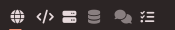
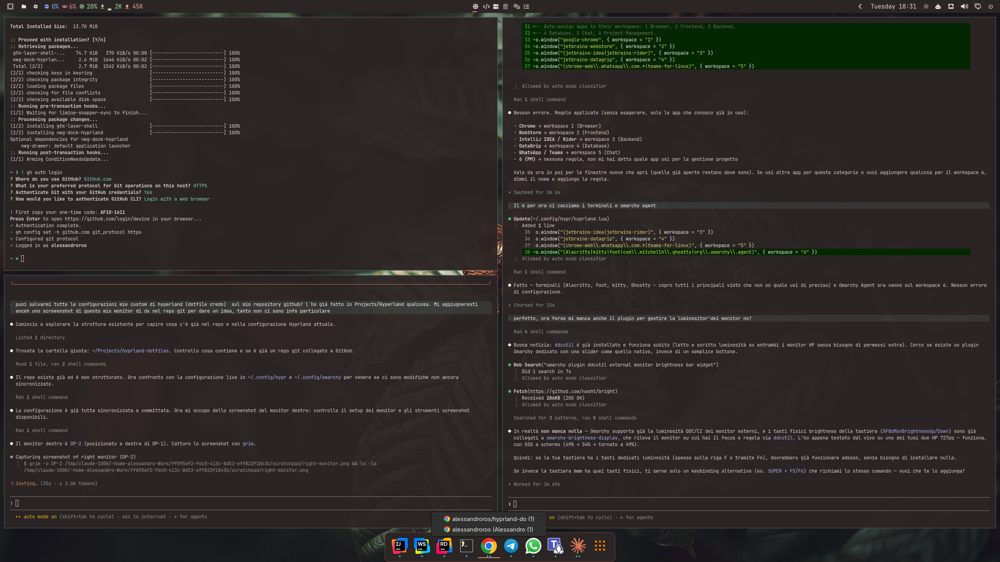

# hyprland-dotfiles

My custom [Hyprland](https://hyprland.org/) configuration, running on top of [Omarchy](https://github.com/basecamp/omarchy).

## Structure

- `hypr/` — Hyprland config (`~/.config/hypr`): keybindings, monitors, look & feel, input, autostart.
- `omarchy/` — Omarchy config (`~/.config/omarchy`): branding, hooks, plugins, themes, shell/bar setup.

## Workspace-per-purpose layout

Instead of using workspaces freely, each one is pinned to a role, and apps are auto-assigned to their workspace by window rules based on the app that launches (`hypr/hyprland.lua`):

| # | Icon | Purpose      | Apps                                  |
|---|:----:|--------------|----------------------------------------|
| 1 | 🌐   | Browser      | Google Chrome                          |
| 2 | `</>` | Frontend    | JetBrains WebStorm                     |
| 3 | 🖥️   | Backend      | JetBrains IDEA / Rider                 |
| 4 | 🗄️   | Database     | JetBrains DataGrip                     |
| 5 | 💬   | Chat         | WhatsApp Web, Teams                    |
| 6 | ✅   | Project mgmt / terminal | Alacritty, kitty, foot, Ghostty, agent terminal |

The idea: instead of remembering "where did I leave X", each workspace has one job. Opening an app always sends it to the same place, so `SUPER + <number>` is a shortcut to a *task*, not just a screen. A custom bar widget (`omarchy/plugins/alessandro.workspaces`) shows the six workspaces as icons instead of numbers, dims the empty ones, and underlines the focused one:



## Screenshot

Right monitor (DP-2), showing the workspace bar and terminal setup in action:



## Dock

The bottom dock is [`nwg-dock-hyprland`](https://github.com/nwg-piotr/nwg-dock-hyprland) (`pacman -S nwg-dock-hyprland`), started from `hypr/autostart.lua` pinned to the right monitor (`-o DP-2` — adjust to your own output name from `hyprctl monitors`).

Pinned icons aren't part of `~/.config` — the dock reads them from `~/.cache/nwg-dock-pinned` (one window class per line). This repo keeps a copy at `dock/nwg-dock-pinned`; copy it into place after installing (see below).

If an app's icon doesn't show up in the dock, it looks for a `.desktop` file named after the window *class* (not the app name) under `~/.local/share/applications/`. `dock/applications/` holds the one this needed for WhatsApp (a web app, so its class is auto-generated and doesn't match its real `.desktop` file). The Omarchy Agent (Claude) icon needed the same trick, but that `.desktop` file isn't included here since it points at a JetBrains-cached copy of Anthropic's logo — recreate it locally with `Icon=` pointing at your own copy if you want it.

## Install

```sh
git clone https://github.com/alessandroros/hyprland-dotfiles.git
cp -a hyprland-dotfiles/hypr/. ~/.config/hypr/
cp -a hyprland-dotfiles/omarchy/. ~/.config/omarchy/
cp hyprland-dotfiles/dock/nwg-dock-pinned ~/.cache/nwg-dock-pinned
cp hyprland-dotfiles/dock/applications/*.desktop ~/.local/share/applications/
omarchy theme set tokyo-night
```
